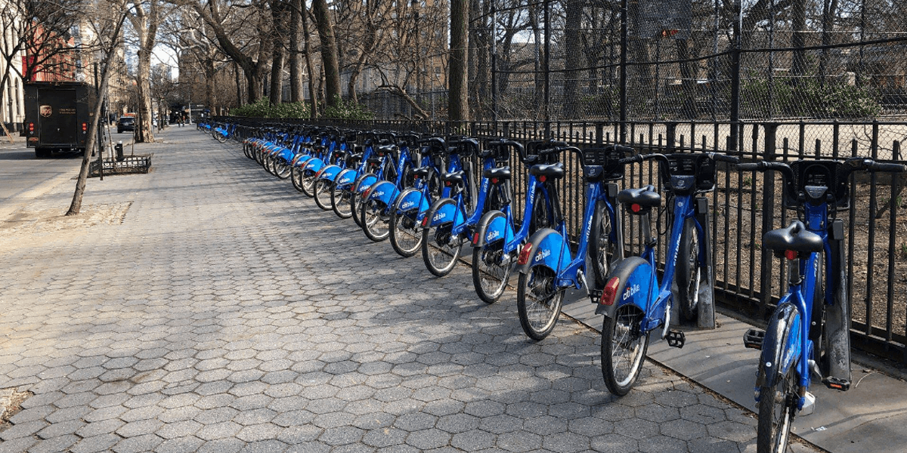

# NY Citibike with Tableau

## Project Overview
For this project, I've used the ever-popular data visualization software tool, Tableau, to create and present a business proposal for a bike-sharing company. I've created worksheets, dashboards, and stories to visualize key data from a New York Citi Bike dataset. I plan to present these visualizations and proposal to an angel investor in the hopes of securing funds to start a bike-sharing business in my hometown of Des Moines, Iowa.

## Resources
- **Data Source**: CSV file containing August 2019 data from the [NYC Citibike](https://www.citibikenyc.com/system-data) website
- **Software and Tools**: Tableau, Python, Pandas, Jupyter Notebook & Git Bash

## Challenge Deliverables and Results

### Deliverable 1: Change Trip Duration to a Datetime Format
Using Python and Pandas functions, I converted the `tripduration` column from an integer to a datetime datatype to get the time in hours, minutes, and seconds (00:00:00). Then, I exported the DataFrame as a CSV file to use for the trip analysis in Deliverable 2.

### Deliverable 2: Create Visualizations for the Trip Analysis
Using Tableau, I created visualizations that show:

**1. How long are bikes checked out for all riders and genders?**

First, I created a line graph displaying the number of bikes checked out by duration for all users, and the graph can be filtered by the hour. This visualization shows that the majority of bike trips last for 20 minutes or less.

Next, I created a line graph displaying the number of bikes that are checked out by duration for each gender by the hour, and the graph can be filtered by the hour and gender. This visualization provides more granular detail than the previous graph, showing that males overwhelmingly make up the majority of bike-share customers.

**2. How many trips are taken by the hour for each day of the week, for all riders and genders?**

First, I created a heatmap showing the number of bike trips for each hour of each day of the week. This visualization shows that the peak times for bike trips are Monday through Friday between 7:00-9:00am and 5:00-6:00pm, which suggests that many bike-share customers use them for their workday commutes. Also, there are a consistent number of bike trips made between 10:00am-6:00pm on Saturdays and Sundays, which one would expect in NYC due to the large tourist presence.

    
Next, I created a heatmap showing the number of bike trips by gender for each hour of each day of the week, and the heatmap can be filtered by gender. This visualization provides more granular detail than the previous heat map, just like the line graphs above, confirming that males are the predominant bike-share users. 

**3. What days of the week might a user be more likely to check out a bike, by type of user and gender?**

I created a heatmap showing the number of bike trips for each type of user and gender for each day of the week, and the heatmap can be filtered by user and gender. This visualization clearly shows that most bike-share trips are made by male subscribers, with the most trips occuring on Thursdays.

### Deliverable 3: Create a Story and Report for the Final Presentation
For this part of the Challenge, I created a story in Tableau.  To view my Tableau dashboard, click [here](https://public.tableau.com/profile/christy.bell#!/).

## Challenge Summary
Provide a high-level summary of the results and two additional visualizations that you would perform with the given dataset.
